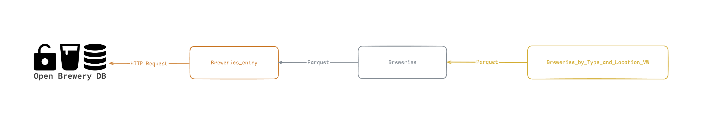

# Projeto Breweries

O projeto Breweries visa buscar informações abertas sobre cervejaria ao redor do mundo.

O projeto foi desenvolvido de forma a executar localmente, de forma a facilitar a configuração e simplificar o a execução do projeto.

# Tecnologias utilizadas

- [Apache Spark](https://spark.apache.org/)
  - [PySpark](https://spark.apache.org/docs/latest/api/python/index.html)

- [Apache Airflow](https://airflow.apache.org/)
  - [Postgres](https://www.postgresql.org/) como armazenamento do Apache Airflow

- [Dremio](https://www.dremio.com/) é uma plataforma de Lakehouse e foi principalmente utilizado para catálogo

- [Docker](https://www.docker.com/)
  - [Docker-Compose](https://docs.docker.com/compose/)

# Hierarquia das pastas

Pastas versionadas:

- 📁 dags
  - Orquestração de Jobs utilizanod Apache Airflow
- 📁 src
  - Jobs em Apache Spark
- 📁 tests
  - Testes unitários

Pastas geradas:

- 📁 data
  - Volume montado com o Data Lake gerado
- 📁 logs
  - Volume montado com o logs de execução do Apache Airflow

# Arquitetura



# Monitoramento e Alertas

A estratégia de monitoramento deve ser feito em camadas:

- Periodicamente devemos verificar a interface do Apache Airflow para verificar:
  - Erros catastróficos nos Jobs executados
  - Tempo de processamento em cada execução
  - Logs de execução de cada execução.

Em casos de **erros catastróficos** serão enviados para um email com acesso aos responsáveis de plantão.

# Métricas de qualidade

Em relação as métricas de qualiade podemos mensurar:

- Volume de dados processados a cada execução vs histórico
- Contagem de valores nulos em colunas críticas
- Regras de negócio específicas

# Orquestração

## breweries_bronze

**Objetivo:** download das informações da base aberta de cervejaria.

**Frequência:** podemos verificar a frequência de atualização da base de dados aberta e nos adaptarmos a essa frequência.

**Fonte de dados:**

- [Open Brewery DB](https://www.openbrewerydb.org/)
  - [List Breweries](https://www.openbrewerydb.org/documentation#list-breweries)
  - [Metadata](https://www.openbrewerydb.org/documentation#metadata)

**Destino dos dados:**

- Spark warehouse no container `spark-master`
  - Caminho: `spark-warehouse/breweries_bronze`
  - É montado um volume entre o container e o host `./data:/opt/bitnami/spark/spark-warehouse`

**Apache Airflow:**

- DAG: `Breweries`
- Operadores: `SparkSubmitOperator`
- Script: `src/breweries_bronze.py`
- Dependência: nenhum
- Política de retentativa: máximo de 3
- Execuções concorrentes: 1 execução concorrente

### Lógica de processamento

O `List Breweries` é endpoint que retorna todas as cervejarias paginadas, exemplo:

```py
# GET https://api.openbrewerydb.org/v1/breweries?page=15&per_page=3
```

Assim, foi desenvolvido um UDF (User Defined Function) para fazer essas requisições e poder utilizar todos os recursos do cluster.

Para isso partimos do endpoint `Metadata` que provê a quantidade de cervejaria e dividimos isso me páginas.

### Tratamento de erros

O Job `breweries_bronze` pode apresentar as seguintes exceções:

- Falha ao buscar os metadados
- Falha ao analisar os metadados
- Falha ao buscar os dados de cervejarias

Para qualquer um dos casos acima o Job irá ser encerrado e marcado como falha.

## breweries_silver

**Objetivo:** refinamento dos dados de cervejaria e particionamento para preparar os dados para futuros processamentos analíticos.

**Frequência:** podemos verificar a frequência de atualização da base de dados aberta e nos adaptarmos a essa frequência.

**Fonte de dados:**

- Resultado do Job `breweries_bronze`

**Destino dos dados:**

- Spark warehouse no container `spark-master`
  - Caminho: `spark-warehouse/breweries`
  - É montado um volume entre o container e o host `./data:/opt/bitnami/spark/spark-warehouse`

**Apache Airflow:**

- DAG: `Breweries`
- Operadores: `SparkSubmitOperator`
- Script: `src/breweries_silver.py`
- Dependência: Dados atualizados `breweries_bronze`
- Política de retentativa: máximo de 3
- Execuções concorrentes: 1 execução concorrente

### Lógica de processamento

Particionamento por localização. Localização é composta pelo campo `country` da cervejaria.

É necessário fazer uma transformação no campo `country` para remover espaços brancos desnecessários no começo e no final do nome.

## breweries_by_type_and_location

**Objetivo:** agregação das cervejarias por tipo de localização para buscar informações como o total de cervejarias.

**Frequência:** podemos verificar a frequência de atualização da base de dados aberta e nos adaptarmos a essa frequência.

**Fonte de dados:**

- Resultado do Job `breweries_silver`

**Destino dos dados:**

- Spark warehouse no container `spark-master`
  - Caminho: `spark-warehouse/breweries_by_type_and_location_VW`
  - É montado um volume entre o container e o host `./data:/opt/bitnami/spark/spark-warehouse`

**Apache Airflow:**

- DAG: `Breweries`
- Operadores: `SparkSubmitOperator`
- Script: `src/breweries_silver.py`
- Dependência: Dados atualizados `breweries`
- Política de retentativa: máximo de 3
- Execuções concorrentes: 1 execução concorrente

### Lógica de processamento

Nenhum processamento complexo foi empregado.